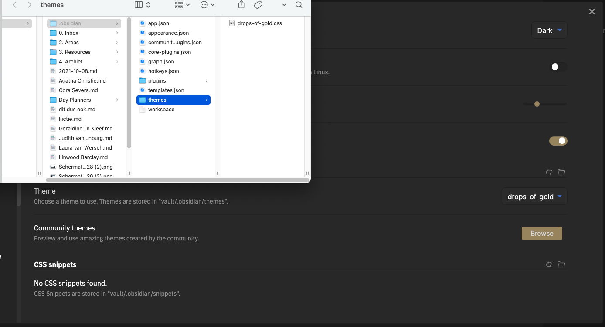
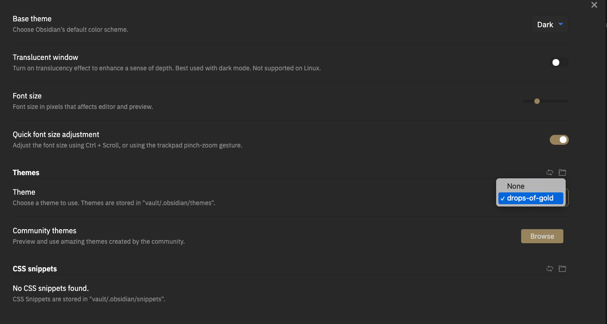

# Obsidian Drops of Gold Theme

The Drops of Gold scheme for Obsidian is based on my personal WordPress theme over at <a href="https://thijs.website" traget="_blank">thijs.website</a> by <a href="https://github.com/thijswmoens">Thijs Moens</a>.
 

### Installation

1. Download the css file.
2. Open in Obsidian the settings > appearance > Themes > open themes folder
3. Place the css file in that folder
   
4. Pick the new Drops of Gold theme under themes.
   
5. There you are
    

## More Drops of Gold

I have made more Drops of Gold color themes for other apps/software:

-   [Drops of Gold for Google Chrome](https://github.com/thijswmoens/drops-of-gold-google-chrome)
-   [Drops of Gold for Alfred](https://github.com/thijswmoens/drops-of-gold-alfred)
-   [Drops of Gold for Hyper](https://github.com/thijswmoens/drops-of-gold-theme-hyper/)

 

### Changelog

[❯ Read the changelog here →](changelog.md)

 

### Use of Fonts

For this theme I picked the free IBM Plex Sans Font from Google Fonts.

I personally use Brandon Text for my sans font. Unfortunately, it's a paid font, so I can't include it here. [For $35 dollars you can purchase it yourself.](https://www.myfonts.com/collections/brandon-text-font-hvd-fonts). My title font is [Filson Pro.](https://fonts.adobe.com/fonts/filson)

 

### Reporting bugs

If you find an issue, [let me know here on Github](https://github.com/thijswmoens/drops-of-gold-theme-obsidian/issues/new) or use the contact form [on my website](https://thijs.webiste/bugs).

### Contributions

Anyone is welcome to contribute to this Google Chrome Theme.

There are various ways you can contribute:

-   [Raise an issue](https://github.com/thijswmoens/drops-of-gold-theme-obsidian/issues) on GitHub.
-   Send us a Pull Request with your bug fixes and/or new features.
-   Provide feedback and [suggestions on enhancements](https://thijs.website/feedback).

 

## :coffee: Sponsor

Enjoy my Open Source and free work and [Don't forget to tip the waiter.](https://github.com/thijswmoens/sponsor) ☕

    
&nbsp;<small> Follow me on Twitter</small>

    
&nbsp;<small>Check out my website with interessting articles</small>

    
&nbsp;<small>Connect on LinkedIn</small>

