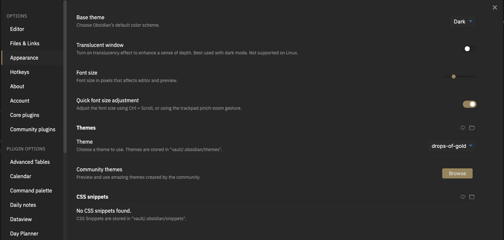

<h1 align="center">Obsidian Drops of Gold Theme</h1>
<h5 align="center">The Drops of Gold scheme for Obsidian is based on my personal WordPress theme over at <a href="https://moenspost.nl" traget="_blank">MoensPost</a> by <a href="https://github.com/moensthijs">Thijs Moens</a>.</h5>

## Table of Contents

- [Table of Contents](#table-of-contents)
- [Screenshots](#screenshots)
- [Installation](#installation)
- [Bugs](#bugs)
- [Changelog](#changelog)
- [License](#license)

## 📷 Screenshot

  

## :computer: Installation

1. Download the css file.
2. Open in Obsidian the settings > appearance > Themes > open themes folder
3. Place the css file in that folder
   
4. Pick the new Drops of Gold theme under themes.
   
5. There you are

## 🐛 Bugs

See the [open issues](https://github.com/moensthijs/drops-of-gold-theme-obsidian/issues) for a list of bugs and known issues.

## Contributing

If you are interested in helping contribute, please take a look at our [Contributing](CONTRIBUTING.md) guide.

## Changelog

See [Changelog](CHANGELOG.md) for a human-readable history of changes.

## License

Distributed under the MIT License. See [LICENSE](LICENSE) for more information.
